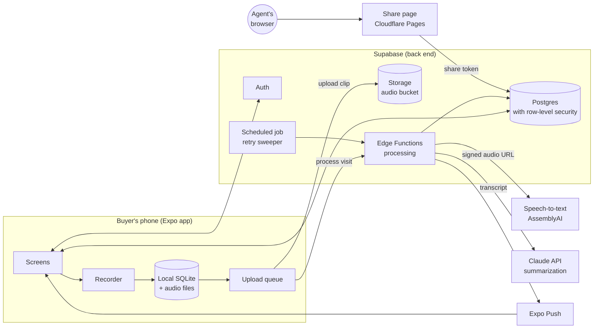
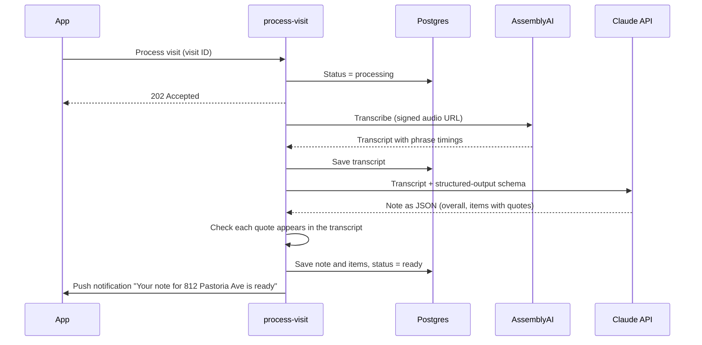

# NORA: Buyer Tour Intelligence

NORA is a voice note-taking app for home buyers visiting open houses. Right after leaving a home, the buyer records a **40–60 second spoken reaction**: what stood out, what they liked, what worried them. NORA turns it into an organized note with three lists: **Liked**, **Concerns**, and **Questions for my agent**. Every visit is saved against the property, so the notes work as a memory aid weeks later, and a note can be sent to the buyer's agent in a couple of taps.

This document covers:

1. [What the app does](#1-what-the-app-does) (the full product vision)
2. [MVP scope](#2-mvp-scope): what's in, what's left out, and why
3. [System design](#3-system-design): platform, architecture, data storage, front end, back end
4. [Third-party services and cost](#4-third-party-services-and-cost)
5. [Build plan](#5-build-plan)
6. [Beta test](#6-beta-test): moving NORA to company-owned accounts and inviting testers
7. [Risks and open questions](#7-risks-and-open-questions)

To run or deploy the code, see [SETUP.md](SETUP.md). App Store review requirements and what's still open: [docs/APP_STORE.md](docs/APP_STORE.md).

> **Design assumption:** NORA records one short reaction after each visit, not the whole tour. The buyer records alone, typically in the car or on the sidewalk, while the home is still fresh in their mind. This matches the original mockup ("Talk naturally for 40–60 seconds") and keeps the app quick to use, cheap to run, and free of the consent problems that come with recording other people.

---

## 1. What the app does

The full product vision draws on the front-end mockup (nexx-tour-intelligence.franksun0707.chatgpt.site) and the design review that followed it.

### The buyer's flow

| Step | What happens |
|---|---|
| **Locate** | The buyer taps "Record a home." GPS suggests the property they just left ("812 Pastoria Ave, is this it?"). They confirm with one tap or type the address. |
| **Record** | The buyer talks for 40–60 seconds. On-screen prompts help them cover the main things ("What stood out?", "Anything that worried you?", "Would you come back?"). Recording stops on its own at 2 minutes, and they can re-record if they fumble. |
| **Process** | The clip is transcribed and summarized, usually in under 30 seconds. If the phone has no signal, the clip is saved and processed once it reconnects. |
| **Review** | The note shows a short overall impression, then **Liked**, **Concerns**, and **Questions for my agent**. Each point shows the words it came from, and the full transcript is a tap away. |
| **Remember** | Each property has a page with every visit to it. The buyer can browse past homes and search by address. |
| **Share** | The buyer sends a note to their agent as a private link and chooses whether the transcript is included. |

### Features beyond the MVP

These come from the mockup and the review, and are planned for later phases:

- **A reminder to record**, sent when the buyer leaves an open house without recording (geofence), so no visit is forgotten.
- **Agent workspace:** an agent account with ongoing access to the buyer's tours, where the agent can add professional notes alongside the buyer's.
- **Listing photos and more property detail** from a licensed listing data provider, plus the buyer's own photos attached to a visit.
- **Buyer priorities** (budget, commute, schools, must-haves) used to check notes and explain scores.
- **Co-buyers** recording reactions to the same home and comparing them.

---

## 2. MVP scope

**The MVP has one job:** right after a visit, a buyer can record a one-minute reaction, get back a trustworthy note, find it again later, and send it to their agent.

Something belongs in the MVP only if leaving it out would break that job. Everything else waits until real users have recorded real visits.

### In the MVP

| # | Feature | Notes |
|---|---|---|
| 1 | **Sign in** with Apple, Google, or email code | No passwords. Apple sign-in is required by the App Store whenever Google sign-in is offered. |
| 2 | **Pick the property** | GPS suggests the nearest address, which the buyer confirms or edits (one line, plus a unit number for condos). The buyer's own properties nearby are offered first. If the address matches an existing property, the visit is added to it. |
| 3 | **Record a short reaction** | Prompts on screen and a timer that turns green at 40 seconds. Stops on its own at 2 minutes. Re-record before saving. The clip is saved on the phone first. |
| 3a | **Or type it** | "Type instead" on the confirm screen, or when the microphone is off. The text is organized like a transcript, with no transcription step. |
| 4 | **Reliable upload and processing** | Uploads queue and retry until they succeed, so a clip recorded with no signal is processed later. The note usually appears within 30 seconds, and a push notification arrives if the buyer has left the screen. |
| 5 | **Structured note** | An overall impression plus **Liked**, **Concerns**, and **Questions for my agent**. |
| 5a | **One quick question** | After a note is ready, NORA may ask one follow-up about something the buyer raised but left unclear ("How much do the nearby power lines concern you?") with three one-tap answers, or Skip. It comes from the same Claude call as the note, and the answer feeds the ranking. |
| 6 | **Check against the source** | Each point shows the quote it came from. The full transcript is one tap away. The original audio is deleted once it's transcribed. |
| 7 | **Edit the reaction** | On a home's page, Edit opens "Your words. Your reaction.": the buyer rewrites the summary and NORA updates the Liked and Concerns bubbles from the new words (each bubble must quote them). The text is marked as the buyer's own. |
| 8 | **Tour history and a home's page** | The Tour tab lists every toured home, most recent first, with search by street, city or ZIP. A home's page shows the exterior, NORA fit, price, type, facts and property details, the latest reaction with Liked and Concerns from every visit, Visit history with each visit's original words, and an Agent notes placeholder. Recording at a home already visited asks "Revisiting this home?" and adds a visit. |
| 9 | **Share a note with the agent** | Creates a private, read-only web link and opens the phone's share sheet (text, email, WhatsApp). The buyer chooses whether to include the transcript and can revoke the link at any time. The agent doesn't need an account. |
| 10 | **Delete data** | Delete a visit, a property, or the whole account, including transcripts and any audio not yet deleted. This is required by the App Store and expected by users. |
| 10a | **Download my data** | Privacy & data exports the buyer's profile, homes, notes, transcripts and rankings as one JSON file through the share sheet. |
| 11 | **Home facts and thumbnail** | Each home shows beds, baths, square feet and the listing (or last sale) price, looked up once from RentCast's public-record and listing data. A small street-level thumbnail is made on the phone with Apple Look Around (a map snapshot where there's no coverage), so homes in lists are easy to tell apart. |
| 12 | **Ranking and Ask NORA** | A Ranking tab lists all the buyer's homes best fit first, each with a thumbnail, a rough 0–10 score (for relative comparison: close scores are a close call, a big gap is a clear difference), a 2–4 word label and, when open, the latest reaction summary, pro and con tags and "Open this note". NORA re-ranks by itself after a new note or new discussion. The buyer can drag homes into their own order, which is saved and passed to NORA as a strong preference; "Restore NORA ranking" goes back. **Ask NORA**, the raised tab in the middle of the bar, is one conversation about the whole search (compare homes, spot patterns, what to ask the agent), which also refines the priorities the next ranking uses. |

### Left out of the MVP

| Feature | Why it's left out | When |
|---|---|---|
| Reminder to record when leaving a home | Needs background location permission, which many buyers decline and app review scrutinizes. | Phase 2 |
| Agent accounts, invitations, agent notes | A second user type, permissions, and onboarding. A share link covers the core need with none of that. | Phase 3 |
| Listing photos | Copyrighted and only available through licensed MLS feeds. The MVP shows a street-level thumbnail made on the phone instead (see feature 11). | Phase 3 |
| Photos in notes | Valuable, but it adds storage, upload, and interface work. Buyers already have photos in their camera roll. | Phase 2 |
| Co-buyers and shared searches | Sharing between two buyers is a larger permissions problem. | Phase 3 |
| Android app | The code is shared, so Android follows the iOS launch with mostly testing and store work. | Phase 1.5 |
| Languages other than English and Chinese | Keeps prompts and quality testing focused. English, Chinese, and speech that mixes the two already work, with no language setting. | Phase 3 |
| Comparing homes, searching by feature ("homes with a big kitchen") | Needs enough data per user to be useful. | Phase 2 |
| Editing notes offline | Recording and reading work offline. Edits need a connection, which keeps sync simple. | Phase 2 |

---

## 3. System design

### 3.1 Platform recommendation

**Build a cross-platform native app with React Native (Expo). Launch on iOS first and ship Android from the same codebase soon after. Agents see shared notes on a small web page.**

| Option | Verdict | Reason |
|---|---|---|
| **Web app / PWA** | ⚠️ Viable alternative | A one-minute recording made with the screen on works in a mobile browser, so a web app is now possible: it needs no app store, costs nothing to distribute, and updates instantly. It loses out on three things the MVP relies on. iOS only delivers push notifications to web apps added to the home screen. Browser storage for clips recorded offline can be cleared by the system. And "add to home screen" is real friction for buyers. |
| **Native iOS (Swift) + native Android (Kotlin)** | ❌ | Two codebases and twice the work for an app whose native needs (microphone, GPS, notifications, local storage) are standard. |
| **React Native + Expo** | ✅ | One codebase for iOS and Android. Reliable microphone, location, push notifications, and on-device storage. App Store presence, which also builds trust when a buyer's agent recommends the app. Expo's cloud build service removes the need for a Mac build server, and over-the-air updates allow quick fixes. The language (TypeScript) is the same as the back end and the share page. |
| **Flutter** | ⚠️ | Technically equivalent. Choose it only if the team already knows Dart. |

**iOS first** because US home buyers skew toward iPhone and there are fewer device variations to test. **Android follows in Phase 1.5**: the code is shared, and the remaining work is device testing and the Play Store listing.

### 3.2 Architecture overview



**Why Supabase:** a single managed service provides authentication, a relational database with per-user access rules, file storage, and serverless functions. That means no servers to run for the MVP. The data is relational (users → properties → visits → notes), so Postgres fits better than a document store such as Firebase. And because it's standard Postgres, it can move to any other Postgres host later.

### 3.3 Data storage

#### What lives where

| Data | Where it's stored | Why |
|---|---|---|
| Account and profile | Supabase Auth + Postgres | Managed sign-in and session tokens |
| Properties, visits, notes, share links | Postgres | Relational, queryable, protected by per-user access rules |
| Transcript (with phrase timings) | Postgres, on its own table keyed by visit | Small (1–2 KB), read alongside its visit |
| Audio recordings | Supabase Storage, in a private bucket at `<user>/<visit>.m4a`, **only until transcribed** | The server deletes the file as soon as the transcript is saved, and asks AssemblyAI to delete its copy of the transcript. The sweeper deletes any file left behind. |
| Recordings not yet uploaded, the upload queue, offline cache | On the phone: local SQLite plus the app's private file folder | Recording must work with no signal, and nothing is deleted until the server confirms it has the file. |
| Login tokens | Phone's secure storage (iOS Keychain or Android Keystore) | Standard practice for credentials |

#### Data model (conceptual)

```
User 1 ──── * Property 1 ──── * Visit 1 ──── 1 Transcript
                                 └──── 1 Note 1 ──── * Note item (liked / concern / question)
                                              └──── * Share link
```

| Entity | Key contents |
|---|---|
| **User** | Name, email, sign-in method, created date, notification token |
| **Property** | Owner (user), normalized address and unit, latitude/longitude, created date, last-visited date. Facts from RentCast: beds, baths, square feet, price (active listing, past listing, or last sale) with its date, and the lookup status. Unique per user and address, so repeat visits group together. |
| **API usage** | Calls made to metered APIs (RentCast) per calendar month, used to enforce a hard monthly cap. Server only. |
| **Visit** | Property, recorded time, audio file path, duration, status (*uploading → processing → ready*, or *failed*), error message, retry count |
| **Transcript** | Visit, full text, phrases with start and end times, provider and model used |
| **Note** | Visit, overall impression, buyer's free-text personal note, AI model and prompt version |
| **Note item** | Note, type (liked, concern, or question), text, source quote, origin (AI or buyer), edited flag, deleted flag (so regenerating never brings back items the buyer removed), sort order |
| **Share link** | Note, random unguessable token, include-transcript flag, created, expires (default 90 days), revoked date, view count |

**Access rules:** Postgres row-level security limits every row to its owner. Phones can't write transcripts or AI-written note items, and can't move a visit's status past "uploading"; only the server can. The share page never queries tables directly. It calls one database function that looks up the token and returns only the fields that particular link allows.

**Storage sizing:** voice audio is recorded as mono AAC at about 48 kbps, so a one-minute clip is about **0.35 MB**, stored only until it is transcribed. The database footprint per visit is under 10 KB.

**Retention:** original audio is deleted right after transcription (usually within a minute of upload), from Supabase Storage and from AssemblyAI. Transcripts, notes and rankings are kept until the buyer deletes them.

### 3.4 Front end (mobile app)

**Stack:** React Native with Expo and TypeScript, file-based navigation (Expo Router), Expo's audio, location, notification, secure-storage, SQLite, and file-system libraries, and the Supabase client library.

**Screens**

| Screen | Purpose |
|---|---|
| Sign in | Apple, Google, or a code sent by email |
| Home | "Record a home" button, notes still processing, recent visits |
| Confirm property | GPS-suggested address, editable, with the buyer's nearby properties as shortcuts |
| Record | Rotating prompts, a timer that turns green at 40 seconds, stop, re-record, save |
| Note | Status while processing, then overall impression, liked, concerns, questions with quotes. Edit mode, transcript, regenerate, share. |
| Properties | List and search by address, opening to a property page with all its visits |
| Share | Include-transcript toggle, then the phone's share sheet. Existing links with a revoke option. |
| Settings | Account, delete account, sign out |

**How recording works**

- The recording is made in the foreground with the screen on. Its length is guided toward 40–60 seconds and capped at 2 minutes.
- Audio is written directly to a file. On save, the file is moved into the app's private documents folder and logged in the local database before anything touches the network.
- If the clip is shorter than 5 seconds, the app asks the buyer to try again instead of saving it.

**How upload works**

- Each saved visit goes into a persistent upload queue in SQLite with its property details, file path, and duration.
- The queue runs when a visit is saved, when the app comes to the foreground, and when the network comes back. Each item retries with increasing delays.
- Steps per visit: find or create the property, create the visit, upload the clip, ask the server to process it. Each step is safe to repeat, so a retry after a failure never creates duplicates.
- The local audio file is deleted once the note is ready. The server deletes its copy once the transcript is saved.

**Offline behaviour:** recording and saving work offline. Notes and properties the buyer has already seen are cached for reading. Editing needs a connection.

### 3.5 Back end

All server logic runs as Supabase Edge Functions (serverless TypeScript). There is no always-on server.

**Processing pipeline**



A one-minute clip transcribes in several seconds and the note takes 10–30 seconds to write, so one function handles both steps, working in the background after it has replied to the app. The app shows progress by reading the visit's status.

**Back-end functions**

| Function | Triggered by | What it does |
|---|---|---|
| `process-visit` | App (after upload), sweeper, or the buyer tapping **Try again** | Transcribes the clip, writes the note, sends the push notification, then looks up the home's facts with RentCast if it doesn't have them yet. With `regenerate`, it skips transcription and rewrites the note while keeping the buyer's edits. |
| `sweep` | Scheduled every 5 minutes | Finds visits stuck in processing for more than 5 minutes, or failed with fewer than 3 attempts, and runs them again. Also looks up facts for up to 3 homes still waiting (created before the RentCast key was set, held back by the monthly cap, or retried a day after an error). |
| `delete-account` | App | Deletes any remaining audio files, the user's database rows, and the sign-in record |
| `get_shared_note` (database function) | Share page | Looks up the token, checks expiry and revocation, returns only the allowed fields, counts the view |

Share links are created and revoked by the app directly in the database, under the same per-user access rules.

**Summarization design**

- **Model:** Claude Opus 5 (`claude-opus-5`), set through a server setting (`SUMMARY_MODEL`). Claude Sonnet 5 (`claude-sonnet-5`) is a cheaper option once there is a quality test set (see §4).
- **Input:** the transcript and the property address, after a fixed set of instructions. The instructions come first so prompt caching applies.
- **Output:** structured JSON enforced by the API's structured-output feature. It contains an overall impression of one or two sentences, plus a list of items, each with a type (liked, concern, question), short text, and a verbatim quote.
- **Language:** the buyer can speak English, Chinese, or a mix, and never picks a language. AssemblyAI detects it, and the note is written in the language the buyer mostly spoke. Quotes stay word for word.
- **Faithfulness checks:** after the response arrives, the server checks that each item's quote actually appears in the transcript. Items whose quote can't be found are dropped. This is the safeguard against invented points.
- **Refusals:** requests use the API's server-side fallback, so a rare safety-classifier refusal is retried on another model automatically. A remaining refusal marks the visit as failed with a message the buyer can act on.
- **Regenerating:** AI items the buyer hasn't touched are replaced. Items the buyer added, edited, or deleted are kept, and a new AI item that repeats one of them is skipped.

**Share page:** a small static web page on Cloudflare Pages. It reads the token from the URL, calls the `get_shared_note` database function, and shows the note, plus the transcript if the buyer included it. It is marked not to be indexed by search engines, and it never exposes audio in the MVP.

**Security and privacy**

- **AI consent (App Store guideline 5.1.2):** nothing goes to AssemblyAI or Anthropic until the buyer allows AI processing ("Let NORA organize it?" before their first note, or the switch in Profile → Privacy & data). The choice is stored as `profiles.ai_consent_at`, and `process-visit` and `rank-homes` check it before every AI call. A note saved while it's off waits as `needs_consent` and starts once the buyer allows it.
- Data is encrypted in transit (HTTPS) and at rest (Supabase default).
- Row-level security on every table. Service keys exist only inside Edge Functions.
- Audio is never served back. The transcription service reads it through a signed URL that expires after 10 minutes, and the file is deleted once transcribed.
- Share tokens are 128-bit random values that can be revoked and expire after 90 days.
- Anthropic doesn't train on API data by default. Check AssemblyAI's terms on training and retention (its pricing page doesn't say) and state both in the privacy policy.
- Error monitoring (Sentry) and product analytics (PostHog) never receive transcript or note text.

---

## 4. Third-party services and cost

> Prices are list prices as of 2026 where known (Claude API rates are current). Other vendors' prices are estimates from their public pricing pages, so **check each one before committing**. Every figure is in USD.

### Assumptions

- An average reaction lasts **1 minute** (about 150 words).
- An active buyer records **8 visits a month** while searching.
- Claude reads about **1,000 input tokens** per visit (instructions plus transcript) and writes about **1,000 output tokens** (the note plus reasoning).
- Almost every visit is to a **new home** (second visits are rare), and each new home costs **1–2 RentCast calls, once**. It's 1 call when an active listing has beds, baths, size and price; otherwise a second call fetches the public record. The first real home took 1 call.

### Cost per visit

| Item | Calculation | Cost per visit |
|---|---|---|
| Transcription (AssemblyAI Universal-3.5 Pro, pre-recorded audio, $0.21/hour) | 1 min × $0.0035/min | ~$0.0035 |
| Summarization, Claude Opus 5 ($5 per million input tokens, $25 per million output) | 1k × $5/M + 1k × $25/M | ~$0.03 |
| Storage and data transfer | ~0.35 MB, stored only until transcribed | <$0.001 |
| **Total with Claude Opus 5** | | **≈ $0.034** |
| *Alternative: summarize with Claude Sonnet 5 ($2 / $10 per million)* | 1k × $2/M + 1k × $10/M | *~$0.012, for a total of ≈ $0.016 per visit* |

The model choice should be made with a small quality test: 30–50 real or realistic reactions, scored for missed points and invented points. If Sonnet 5 holds up on that test, switching halves the AI cost. At these amounts either choice is cheap.

### Cost per ranking turn

Each Ask NORA message and each re-rank is one Claude call (an Edit reaction preview is one note-sized call). Claude reads the instructions, a summary of every home (about 300 tokens each), what it has learned, and the recent conversation, then writes a reply, the full ranking with reasons, and the updated priorities.

| Item | Calculation (10 homes, Claude Opus 5, medium effort) | Cost per turn |
|---|---|---|
| Input | ~7,000 tokens; instructions and home summaries are cached after the first turn (cache reads cost a tenth) | ~$0.01–0.035 |
| Output | ~1,500 tokens (reply, ranking, priorities, reasoning) × $25/M | ~$0.04 |
| **Total** | | **≈ $0.05–0.075** |

A buyer who has 10 ranking exchanges a month costs about **$0.50–0.75 a month**. The function allows 60 turns per buyer per day to stop runaway cost. Setting `RANKING_MODEL=claude-sonnet-5` would cut this by more than half.

### Cost per new home (facts)

Home facts (beds, baths, size, price) come from RentCast, billed per API call. Thumbnails are made on the phone with Apple Look Around and cost nothing.

| RentCast plan | Monthly price | Calls included | Each extra call | Effective cost per new home (1–2 calls) |
|---|---|---|---|---|
| Developer | $0 | 50 | $0.20 | Free for the first ~25–50 homes a month |
| Foundation | $74 | 1,000 | $0.06 | ~$0.07–0.15 |
| Growth | $199 | 5,000 | $0.03 | ~$0.04–0.08 |
| Scale | $449 | 25,000 | $0.015 | ~$0.02–0.04 |

NORA enforces its own monthly call cap (`RENTCAST_MONTHLY_LIMIT`, default 45), so a plan's allowance is never exceeded by accident. When the cap is reached, new homes wait for the next month and still show their thumbnail. **Raise the cap when you change plans** (see SETUP.md).

Facts are looked up per buyer, so two buyers who visit the same open house cost two lookups. Sharing lookups across buyers by address would cut this, and is the first optimization to make if RentCast becomes the largest cost.

### Services

| Service | Used for | Pricing model | MVP cost |
|---|---|---|---|
| **Supabase** (Pro plan) | Sign-in, Postgres, storage, Edge Functions, scheduled jobs | $25/month, including 8 GB database, 100 GB storage, 250 GB transfer, 100k monthly active users, plus usage beyond that. The free plan works for development. | $25/month |
| **AssemblyAI** | Speech-to-text. Universal-3.5 Pro detects the language by itself and handles English, Chinese, and speech that switches between them. | Per audio hour: $0.21 for Universal-3.5 Pro ($0.15 for Universal-2, its fallback for other languages). Includes $50 of free credit. | Usage-based |
| **Anthropic Claude API** | Summarizing reactions into notes | Per token. Claude Opus 5: $5 / $25 per million input/output tokens. | Usage-based |
| **Expo EAS** | Cloud builds, app store submission, over-the-air updates | Free tier to start. ~$19/month Starter plan once builds are frequent. | $0–19/month |
| **Expo Push** | Push notifications | Free | $0 |
| **Cloudflare Pages** | Share page hosting | Free tier | $0 |
| **Sentry** | Crash and error reporting | Free developer tier | $0 |
| **PostHog** | Product analytics | Free up to 1M events/month | $0 |
| **Resend** (or Supabase's built-in email for testing) | Sign-in code emails | Free up to 3k emails/month, then $20/month | $0 |
| **Device geocoding** (Apple and Google built-in) | Turning GPS coordinates into an address | Free on the device | $0 |
| **RentCast** | Beds, baths, square feet, price per home (1–2 calls per new home, once) | Per call, by plan: Developer $0 (50 calls), Foundation $74 (1,000), Growth $199 (5,000), Scale $449 (25,000), plus a per-call fee beyond the allowance. The app enforces its own monthly cap. | $0 in development; $74/month for a pilot |
| **Google Places API (New)** | Address suggestions while typing on Choose a Home (through the `places` Edge Function; the key stays on the server) | Autocomplete $2.83 per 1,000 requests and Place Details Essentials $5 per 1,000, each with 10,000 free a month; typing in one search is one session, so a pilot stays inside the free tier | $0 at pilot scale |
| **Apple Look Around / Maps snapshots** | Home thumbnails, generated on the phone | Free, no key | $0 |
| **Apple Developer Program** | App Store distribution | $99/year | $99/year |
| **Google Play Console** | Play Store distribution (Phase 1.5) | $25 one-time | $25 one-time |
| **Domain** | Share links (for example, `share.<domain>`) | ~$12–20/year | ~$15/year |

### Monthly running cost by scale

| Scale | Visits (≈ new homes) per month | Notes (Claude Opus 5 + AssemblyAI) | Ranking chat (~10 turns per buyer) | Home facts (RentCast) | Fixed services | **Total per month** |
|---|---|---|---|---|---|---|
| Development: you and a few testers | < 30 | < $1 | < $5 | $0 (Developer plan) | ~$0–25 | **≈ $0–30** |
| Pilot: 50 buyers | 400 | ~$14 | ~$25–40 | ~$74 (Foundation; 400–800 calls) | ~$25–45 | **≈ $140–175** |
| Launch: 500 buyers | 4,000 | ~$135 | ~$250–375 | ~$199–290 (Growth; 4,000–8,000 calls) | ~$45–65 | **≈ $630–865** |
| Growth: 5,000 buyers | 40,000 | ~$1,350 | ~$2,500–3,750 | ~$675–1,275 (Scale; 40,000–80,000 calls) | ~$150–300 (Supabase usage, Resend, Sentry and PostHog paid tiers) | **≈ $4,675–6,675** |

Per buyer who tours 8 homes and has about 10 ranking exchanges a month: notes about $0.27, ranking chat $0.50–0.75, facts $0.32–0.64 (Growth plan), so about **$1.10–1.70 a month**. The ranking chat is the largest variable cost; switching it to Claude Sonnet 5 (`RANKING_MODEL`) is the first lever. Sharing RentCast lookups across buyers is the second.

### One-time costs

| Item | Estimate |
|---|---|
| Apple Developer account (first year) and Google Play registration | $124 |
| Legal review: privacy policy and terms | $1,000–3,000 |
| App icon, store screenshots, basic brand assets (if outsourced) | $500–2,000 |
| Engineering effort | See §5. About 7 weeks for 1–2 engineers plus part-time design. This is the largest cost, and it depends on whether the team is in-house or contracted. |

---

## 5. Build plan

Two full-stack engineers (React Native and TypeScript) plus a part-time product designer. The phases below assume that team.

| Week | Milestone | Done when |
|---|---|---|
| 1 | **Foundations** | Expo project, Supabase project, sign-in with Apple, Google, and email code, database schema with access rules, CI and cloud builds to TestFlight |
| 2 | **Record and queue** | Property confirmation with GPS, recording screen with prompts, local save, upload queue that survives no signal and app restarts |
| 3 | **Processing** | `process-visit` function, AssemblyAI, Claude with quote checks, status tracking, retry sweeper, push notifications |
| 3–4 | **Note quality** | Quality test set of 30–50 reactions, prompt tuning, Opus 5 vs Sonnet 5 comparison |
| 4–5 | **Note, history, editing** | Note screen with quotes, transcript and playback, editing that survives regeneration, property list and pages, offline cache |
| 5–6 | **Sharing and data controls** | Share links, share page, revocation and expiry, account and data deletion, privacy policy, App Store privacy labels |
| 6–7 | **Beta and launch** | TestFlight beta with 20–50 buyers and a few agents during real open-house weekends, fixes, App Store submission |
| +2–3 weeks | **Phase 1.5: Android** | Device testing, Play Store listing |

**What to measure in the beta:**
- At least 99% of saved clips produce a note.
- Median time from saving a clip to the note being ready is under 30 seconds.
- Buyers edit fewer than 15% of items, and invented points are almost never reported.
- The share rate per note.
- Repeat use: buyers who record a second and a fifth home.

---

## 6. Beta test

Today NORA runs entirely on one developer's personal accounts: a free Apple Personal Team, a personal GitHub repository, and personal Supabase, AssemblyAI, Anthropic, RentCast and Resend accounts. Only that developer can install it, and sign-in emails reach only one address. For a beta, **the company (the LLC) must own the app, the code, the data and every paid account**. The developer works inside the company's accounts with a limited role.

This section is the setup checklist, in the order to do it. Every step marked **Owner** must be done by someone with authority to act for the LLC. Steps marked **Developer** are done by the developer once invited.

### 6.1 Principles

- **Company-owned logins.** Create every account with a company email address that isn't tied to one person, such as `admin@<company-domain>`, not a personal Gmail. Anyone the owner chooses can then recover the account.
- **Shared password manager.** Keep all logins, recovery codes and API keys in a company vault (1Password Business or Bitwarden Teams). Turn on two-factor authentication everywhere. Use an authenticator app or hardware key that the owner controls, and store the recovery codes in the vault.
- **Company payment method.** Use a company card on every paid service, so invoices go to the LLC.
- **Least privilege.** The owner keeps the owner/admin role on every account. The developer gets the narrowest role that lets them work (listed below), and can be removed in minutes.
- **Fresh API keys.** Every key the beta uses is created in the company's accounts. Keys from the developer's personal accounts are revoked after the switch (§6.11).
- **Secrets never go in git or chat.** Keys live in Supabase function secrets, EAS environment variables, and the password manager.

### 6.2 Company basics (Owner)

| Item | Why it's needed | Notes |
|---|---|---|
| **Company domain**, for example `<company-domain>` | Company email, the sending address for sign-in codes, the share page (`share.<company-domain>`), the privacy policy URL | Registered in the LLC's name |
| **Company email** `admin@`, plus a `support@` address | Account logins and support contact for App Store Connect | A shared mailbox or alias the owner controls |
| **D-U-N-S number** for the LLC | Apple requires it to enroll an organization | Free from Dun & Bradstreet through Apple's lookup tool. Allow up to ~2 weeks, so **start this first**. |
| **Public website with a privacy policy and terms** | Required for TestFlight external testing and the App Store; also needed by the vendors' terms | Must describe the voice recordings, transcripts, location use, and the third-party processors (Supabase, AssemblyAI, Anthropic, RentCast, Resend) |

### 6.3 Apple Developer Program, as an organization

1. **Owner:** enroll at developer.apple.com/programs/enroll as an **Organization** (not an individual), with the LLC's legal name, D-U-N-S number and website, paying the $99/year with the company card. The person enrolling becomes the **Account Holder** and must have legal authority to bind the LLC. Apple may call to verify.
2. **Owner:** in App Store Connect → **Agreements, Tax, and Banking**, accept the latest agreements (the free-apps agreement is enough for a beta).
3. **Owner:** in App Store Connect → **Users and Access**, invite the developer:
   - Role **Developer**: uploads builds, sees TestFlight, can't change agreements, pricing or users.
   - Add **App Manager** for the NORA app only if the developer should also manage TestFlight testers and app metadata.
   - Leave **Access to Certificates, Identifiers & Profiles** on, so the developer can sign builds for the company team.
4. **Developer:** accept the invitation. Then in Xcode → Settings → Accounts, sign in and confirm the company team appears next to the Personal Team.
5. **Register the app under the company team.** In Certificates, Identifiers & Profiles, create the App ID `com.nexx.tour.intelligence`, with **Push Notifications** and **Sign in with Apple** enabled.
   - The developer's Personal Team registered this identifier during development. If Apple reports it as unavailable, remove it from the personal team (Xcode → Settings → Accounts → Personal Team) or pick a company-style identifier such as `com.<company>.nora`. A new identifier also needs changing in `app/app.json`, and as the Sign in with Apple client ID in Supabase.
6. **Owner or developer:** in App Store Connect, create the app record **NORA** with that bundle ID, under the company. The app, its reviews, and its TestFlight testers now belong to the LLC.
7. **Paid-team build:** build *without* `NORA_FREE_SIGNING`, so push notifications and Sign in with Apple are included again: `npx expo prebuild --platform ios --clean`, then EAS Build (§6.5) with the company team.

**Testers on TestFlight**
- **Internal testers:** up to 100 people added in App Store Connect → Users and Access. No Apple review, available minutes after a build is processed.
- **External testers:** up to 10,000, by email or a public link. The first build of each version goes through a short **Beta App Review**. Apple needs a beta description, a feedback email, the privacy policy URL, and **a way for the reviewer to sign in**. NORA signs in with an emailed code, so the reviewer's address must receive mail: this requires the company sending domain from §6.9. Put sign-in instructions in the review notes.
- TestFlight builds expire after 90 days.

### 6.4 GitHub: company organization

1. **Owner:** create a GitHub **organization** (the Free plan is enough) with the company admin email, for example `github.com/<company>`. Turn on "Require two-factor authentication" for members.
2. **Developer:** transfer the repository: `shawlu95/nexx_tour_intelligence` → Settings → Danger Zone → **Transfer ownership** → the company organization. History, issues and branches move with it, and GitHub redirects the old URL. (The developer must be allowed to create repositories in the organization for the transfer; the owner can grant this temporarily.)
3. **Owner:** add the developer as an organization **Member** (not Owner), and give them **Write** (or **Maintain**) access to the repository. The developer shows up as a contributor through their commit history.
4. **Owner:** protect `main` (Settings → Branches): require pull requests and block force pushes.
5. **Developer:** update the local clone: `git remote set-url origin https://github.com/<company>/nexx_tour_intelligence.git`.

### 6.5 Expo / EAS: company organization

1. **Owner:** create an Expo account with the company email, then an **organization** for the company (expo.dev → Create organization). For more than occasional builds, choose a paid plan with the company card (Starter ~$19/month).
2. **Owner:** invite the developer with the **Developer** role (can build and submit; can't manage billing or members).
3. **Developer:** set the owner in `app/app.json` (`"owner": "<expo-org-slug>"`), then run `npx eas-cli@latest init`. This creates the project under the organization and writes its `projectId`, which also turns on push notifications.
4. **Developer:** add the environment variables to EAS (`npx eas-cli@latest env:create`, for the preview and production environments):
   - `EXPO_PUBLIC_SUPABASE_URL`
   - `EXPO_PUBLIC_SUPABASE_ANON_KEY`
   - `EXPO_PUBLIC_SHARE_BASE_URL`

   These are the company project's values from §6.6 and §6.10.
5. **Developer:** `npx eas-cli@latest build --platform ios --profile production`. Sign in with the developer's Apple ID when asked, choose the **company team**, and let EAS create the distribution certificate and provisioning profile. Then run `npx eas-cli@latest submit --platform ios` to send the build to TestFlight.

### 6.6 Supabase: company organization and project

1. **Owner:** create a Supabase account with the company email, and an **organization** for the LLC on the **Pro plan** ($25/month, company card). Pro avoids free-tier pausing after a week of inactivity and adds daily backups. Both matter once testers depend on it.
2. **Owner:** invite the developer to the organization with the **Developer** role (can change the database and functions; can't change billing or members).
3. **Move the project.** Pick one:
   - **Transfer** the existing project `nexx-tour-intelligence` to the company organization (Project Settings → General → Transfer project). This keeps the current data. The developer must be a member of both organizations when transferring.
   - **Or create a new project** in the company organization and set it up from scratch with SETUP.md §2 (`supabase link`, `db push`, deploy the four functions, the Vault entries for the retry job). This is cleaner for a beta: test data from development doesn't come along. **Recommended.**
4. Either way, set every function secret again with the **company's** new keys (§6.7–6.9):
   ```bash
   supabase secrets set ASSEMBLYAI_API_KEY=... ANTHROPIC_API_KEY=... RENTCAST_API_KEY=... RENTCAST_MONTHLY_LIMIT=950
   ```
   Set `SWEEP_SECRET` and its Vault entry with the snippet in SETUP.md.
5. Redo the dashboard settings from SETUP.md §2:
   - SMTP through the company's Resend account and sending domain (§6.9)
   - the sign-in email templates with `{{ .Token }}`
   - the redirect URL `nora://auth-callback`
   - Apple and Google sign-in providers, if used

### 6.7 AssemblyAI (speech-to-text)

1. **Owner:** sign up at assemblyai.com with the company email. Add the company card under Billing (pay as you go; new accounts get $50 of free credit).
2. **Owner:** invite the developer to the account, without billing access.
3. **Owner or developer:** create a new API key named `nora-beta-supabase`. Copy it straight into the password manager and into `supabase secrets set ASSEMBLYAI_API_KEY=...`.
4. Optional: set a usage alert under Billing.

### 6.8 Anthropic (Claude)

1. **Owner:** create an organization at console.anthropic.com with the company email, under the LLC's name, and add the company card under Billing. Accept the commercial terms for the LLC. Anthropic doesn't train on API data by default; confirm the retention terms fit the privacy policy.
2. **Owner:** invite the developer with the **Developer** role (can create and use API keys; can't change billing or members).
3. **Owner:** create a **workspace** named `nora-beta`, and set a **monthly spend limit** on it. About $50–100 covers a 50-tester beta; see §4.
4. **Developer:** create an API key in that workspace, then run `supabase secrets set ANTHROPIC_API_KEY=...`.
5. Optional: `SUMMARY_MODEL` and `RANKING_MODEL` (default `claude-opus-5`).

### 6.9 Resend (sign-in email) and the sending domain

1. **Owner:** create a Resend account with the company email. Under Billing, the free plan (3,000 emails/month, 100/day) is enough for a beta.
2. **Owner:** invite the developer to the team (Member).
3. **Owner or developer:** **verify the company domain**: Domains → Add domain → `<company-domain>` (or `mail.<company-domain>`), then add the DNS records Resend shows (SPF, DKIM, and optionally DMARC) at the domain's DNS host. **This step is what lets every tester receive sign-in codes**; the test sender `onboarding@resend.dev` only delivers to the Resend account's own address.
4. Create an API key with **Sending access** only. Enter it as the SMTP password in the company Supabase project (Authentication → Emails → SMTP Settings):
   - **Sender:** `no-reply@<company-domain>`, name NORA
   - **Host:** `smtp.resend.com`, port `465`, username `resend`
5. Raise **Authentication → Rate Limits → emails per hour** if testers sign in at the same time (default 30).

### 6.10 RentCast, share page hosting, and Google sign-in

**RentCast (home facts)**
1. **Owner:** create a RentCast account with the company email.
2. **Owner:** subscribe to an **API plan**. A key without an active plan is refused with "subscription-inactive". For a 50-tester beta, choose **Foundation** ($74/month, 1,000 calls) with the company card.
3. Create an API key, then run `supabase secrets set RENTCAST_API_KEY=... RENTCAST_MONTHLY_LIMIT=950`.

**Share page (Cloudflare Pages)**
1. **Owner:** create a Cloudflare account with the company email and add the company domain. Free plan.
2. **Owner:** invite the developer as a member with access to Pages.
3. **Developer:** deploy `share-web/` as a Pages project, with `share-web/config.js` pointing at the company Supabase project. Attach `share.<company-domain>`. Set `EXPO_PUBLIC_SHARE_BASE_URL=https://share.<company-domain>` in EAS.

**Google sign-in (optional)**
1. **Owner:** create a Google Cloud project under a company Google account, and configure the OAuth consent screen under the company name.
2. Create the OAuth client and enter it in Supabase → Authentication → Providers → Google.

### 6.11 Switch-over checklist

Do these once the company accounts work, before inviting testers:

- [ ] The company Supabase project holds every secret, and none of them comes from a personal account.
- [ ] A TestFlight build from the company team signs in (code arrives from `no-reply@<company-domain>`), records, and shows a note, facts, and a ranking.
- [ ] A share link opens at `share.<company-domain>`.
- [ ] Push notifications arrive (company team build, EAS project id set).
- [ ] **Revoke the developer's personal keys:** AssemblyAI, Anthropic, RentCast and Resend API keys from the development accounts. Pause or delete the development Supabase project (or keep it as a separate dev environment, clearly labeled).
- [ ] Remove personal values from the developer's machine: `app/.env.local` and `share-web/config.js` now point at the company project.
- [ ] The password manager has every login, recovery code and key, and at least two company people can access it.
- [ ] Every account's Owner/Admin is the company. The developer has the roles listed above.

### 6.12 Who owns what

| Service | Account owner | Developer role | Paid by |
|---|---|---|---|
| Apple Developer Program / App Store Connect | LLC (Account Holder) | Developer (App Manager for NORA, optional) | LLC, $99/year |
| GitHub | LLC organization | Member, Write/Maintain on the repo | Free |
| Expo / EAS | LLC organization | Developer | LLC, $0–19/month |
| Supabase | LLC organization | Developer | LLC, $25/month |
| AssemblyAI | LLC | Member | LLC, usage |
| Anthropic | LLC organization | Developer, in workspace `nora-beta` | LLC, usage, with a spend limit |
| Resend | LLC | Member | Free at beta volume |
| RentCast | LLC | (shared key in the vault) | LLC, $74/month (Foundation) |
| Cloudflare | LLC | Member (Pages) | Free |
| Domain and DNS | LLC | none | LLC, ~$15/year |

**Expected beta cost** (50 testers, §4): about **$140–175 a month** in services, plus $99/year for Apple and ~$15/year for the domain.

## 7. Risks and open questions

| Risk | Mitigation |
|---|---|
| **Buyers forget to record after leaving** | A large "Record a home" button on the home screen and a quick flow (two taps to start). A reminder when leaving an open house is planned for Phase 2. |
| **Short reactions miss things the buyer would want to remember** | Rotating prompts during recording. Buyers can add points and personal notes by typing. NORA asks one quick follow-up question when something important was left unclear. |
| **Note quality: missed or invented points** | A quote with every item, server-side quote checking, the transcript one tap away, and a quality test set run on every prompt change. |
| **Poor connection outside the home** | The clip is saved on the phone first, and the upload queue retries until it succeeds. |
| **Address matching** (condo units, new builds, GPS drift) | Suggest an address but always let the buyer confirm or edit. Record a unit number. Offer the buyer's own nearby properties first. |
| **Vendor dependence** | Transcription and summarization each sit behind one back-end module, so AssemblyAI can be swapped (for example, for another provider that handles mixed Chinese and English) and Claude models can change without touching the app. |

**Open questions for the team**

1. **Business model:** will buyers pay, or agents and brokerages? This decides whether agent features move up from Phase 3.
2. **Agent pilot:** is there an agent or brokerage partner who can recruit beta buyers and give feedback on the share page?
3. **Branding and domain** for share links.
