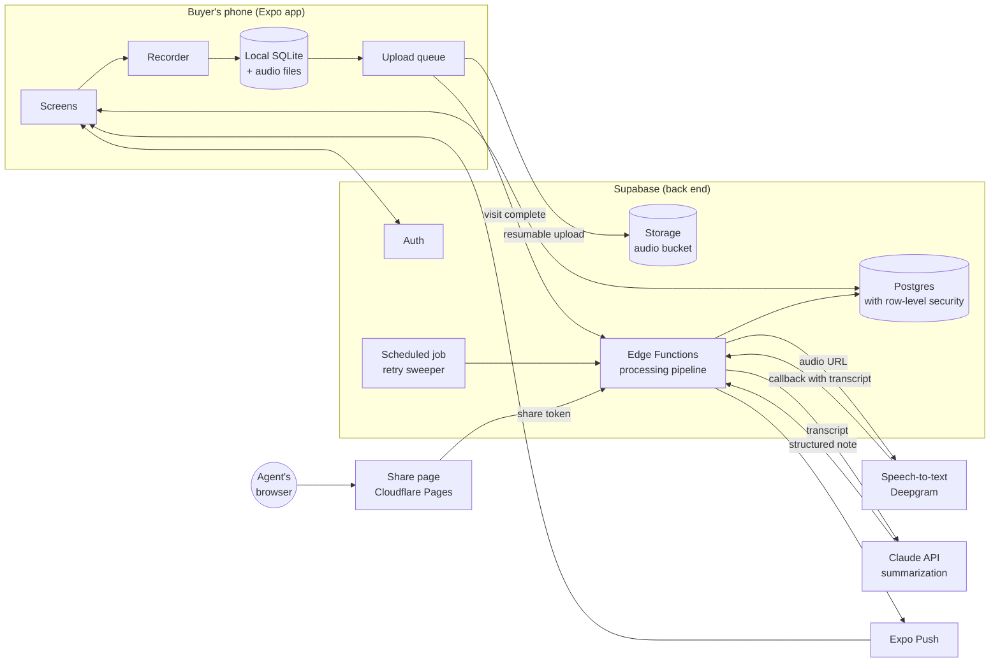
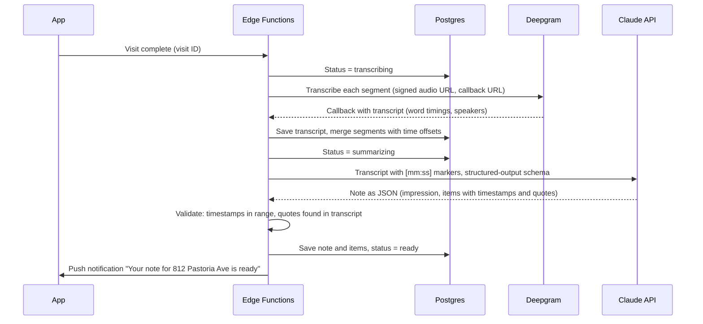

# NORA: Buyer Tour Intelligence

NORA is a voice note-taking app for home buyers visiting open houses. The buyer talks to their phone during a 10–15 minute visit, and NORA turns what they said into an organized note: what they liked, what concerned them, and what to ask their agent. Every visit is saved against the property, so the notes work as a memory aid weeks later, and a note can be sent to the buyer's agent in a couple of taps.

This document covers:

1. [What the app does](#1-what-the-app-does) (the full product vision)
2. [MVP scope](#2-mvp-scope): what's in, what's left out, and why
3. [System design](#3-system-design): platform, architecture, data storage, front end, back end
4. [Third-party services and cost](#4-third-party-services-and-cost)
5. [Build plan](#5-build-plan)
6. [Risks and open questions](#6-risks-and-open-questions)

---

## 1. What the app does

The full product vision draws on the front-end mockup (nexx-tour-intelligence.franksun0707.chatgpt.site) and the design review that followed it.

### The buyer's flow

| Step | What happens |
|---|---|
| **Arrive** | The app uses GPS to suggest the property ("812 Pastoria Ave, is this it?"). The buyer confirms with one tap or types the address. |
| **Tour** | The buyer starts recording and walks through the home, talking naturally. Recording continues with the screen locked or the phone in a pocket. They can pause when they don't want to be recorded (for example, while talking with the listing agent). |
| **Process** | When the visit ends, the audio is transcribed and summarized. A notification says when the note is ready. |
| **Review** | The note shows a short overall impression, then **Liked**, **Concerns**, and **Questions for my agent**. Every point links to the moment in the recording where it was said, and the full transcript is available. |
| **Remember** | Each property has a page with every visit to it. The buyer can browse past homes and search by address. |
| **Share** | The buyer sends a note to their agent as a private link and chooses whether the transcript is included. |

### Features beyond the MVP

These come from the mockup and the review, and are planned for later phases:

- **Ranking and fit score** across all toured homes, reorderable by the buyer.
- **Clarifying questions** at the end of a visit about things the buyer raised but left unresolved, or must-haves they never mentioned.
- **Live capture** during the tour: points appear on screen as they're heard, the current room is tagged automatically, and the buyer can star a moment.
- **Lock-screen controls** (an iOS Live Activity) for pause and star.
- **Agent workspace:** an agent account with ongoing access to the buyer's tours, where the agent can add professional notes alongside the buyer's.
- **Property facts and photos** (beds, baths, square feet, listing photos) from a listing data provider, plus the buyer's own photos linked to moments in the visit.
- **Buyer priorities** (budget, commute, schools, must-haves) used to check notes and explain scores.
- **Co-buyers** touring together and sharing a search.

---

## 2. MVP scope

**The MVP has one job:** a buyer can record a whole open-house visit hands-free, get back a trustworthy note, find it again later, and send it to their agent.

Something belongs in the MVP only if leaving it out would break that job. Everything else waits until real users have recorded real visits.

### In the MVP

| # | Feature | Notes |
|---|---|---|
| 1 | **Sign in** with Apple, Google, or email link | No passwords. Apple sign-in is required by the App Store whenever Google sign-in is offered. |
| 2 | **Start a visit at a property** | GPS suggests the nearest address, which the buyer confirms or edits (one line, plus a unit number for condos). If the address matches an existing property, the visit is added to it. |
| 3 | **Long-form recording** | Up to 30 minutes. Continues with the screen locked or the app in the background. Pause and resume. Survives interruptions such as a phone call. Audio is saved on the phone first, so nothing is lost if there's no signal. |
| 4 | **Reliable upload and processing** | Uploads queue and retry until they succeed, including after the app is closed. A push notification says when the note is ready (usually within 1–2 minutes). |
| 5 | **Structured note** | An overall impression plus **Liked**, **Concerns**, and **Questions for my agent**. Each point carries a timestamp. |
| 6 | **Verify against the source** | Tapping a point plays the audio from that moment and shows the quote. The full transcript is one tap away. |
| 7 | **Edit the note** | Change, add, or delete points, and add free-text personal notes. Edits are marked as the buyer's own and are never overwritten by reprocessing. |
| 8 | **Property list and property page** | Homes listed by most recent visit, with search by address. Each property page shows all its visits, newest first. |
| 9 | **Share a note with the agent** | Creates a private, read-only web link and opens the phone's share sheet (text, email, WhatsApp). The buyer chooses whether to include the transcript and can revoke the link at any time. The agent doesn't need an account. |
| 10 | **Delete data** | Delete a visit, a property, or the whole account, including the audio. This is required by the App Store and expected by users. |
| 11 | **Recording notice** | A one-time explanation of recording etiquette and consent, plus a clear recording indicator. Pause doubles as "off the record." |

### Left out of the MVP

| Feature | Why it's left out | When |
|---|---|---|
| Ranking and fit score | Needs several notes per buyer and a defined set of priorities to mean anything. An unexplained score hurts trust. | Phase 2 |
| Clarifying and wrap-up questions | Adds an extra step and a second AI call. The structured note already includes "Questions for my agent." | Phase 2 |
| Live on-screen capture, room tagging, starred moments | Needs streaming speech-to-text, which costs more and is more fragile. The buyer's phone is in their pocket most of the time anyway. | Phase 2 |
| Lock-screen Live Activity | Needs a separate native iOS extension. The system's standard recording indicator is enough for launch. | Phase 2 |
| Agent accounts, invitations, agent notes | A second user type, permissions, and onboarding. A share link covers the core need with none of that. | Phase 3 |
| Listing data and photos (beds, baths, price) | Paid data providers, licensing questions, and address-matching work. The buyer's own words matter more for memory. | Phase 2–3 |
| Photos in notes | Valuable, but it adds storage, upload, and interface work. Buyers already have photos in their camera roll. | Phase 2 |
| Buyer priorities profile | Only needed once there are wrap-up checks and scores. | Phase 2 |
| Co-buyers and shared searches | Sharing between two buyers is a larger permissions problem. | Phase 3 |
| Android app | The code is shared, so Android follows the iOS launch with mostly testing and store work. | Phase 1.5 |
| Buyer web app | The phone is where recording happens. | Not planned |
| Languages other than English | Keeps prompts and quality testing focused. The transcription service supports more languages later. | Phase 3 |
| Comparing homes, searching by feature ("homes with a big kitchen") | Needs enough data per user to be useful. | Phase 2 |

---

## 3. System design

### 3.1 Platform recommendation

**Build a cross-platform native app with React Native (Expo). Launch on iOS first and ship Android from the same codebase soon after. Agents see shared notes on a small web page.**

| Option | Verdict | Reason |
|---|---|---|
| **Web app / PWA** | ❌ | Recording is the core feature, and the browser can't reliably keep recording for 15 minutes with the screen locked. iOS Safari suspends audio capture when a web page goes to the background. Background upload retries and push notifications are also limited. |
| **Native iOS (Swift) + native Android (Kotlin)** | ⚠️ | Best possible control over audio, but it means two codebases and twice the work. That's not justified for an MVP. |
| **React Native + Expo** | ✅ | One codebase for iOS and Android. Expo's audio library supports background recording (iOS background audio mode, Android foreground service). Push notifications, location, secure storage, and over-the-air updates come built in. Expo's cloud build service removes the need for a Mac build server. The language (TypeScript) is the same as the back end and the share page. |
| **Flutter** | ⚠️ | Technically equivalent. Choose it only if the team already knows Dart. |

**iOS first** because US home buyers skew toward iPhone, there are fewer device and audio variations to test, and iOS background audio behaviour is predictable. **Android follows in Phase 1.5**: the code is shared, and the remaining work is testing the foreground-service recorder on a few devices and the Play Store listing.

### 3.2 Architecture overview



**Why Supabase:** a single managed service provides authentication, a relational database with per-user access rules, file storage, and serverless functions. That means no servers to run for the MVP. The data is relational (users → properties → visits → notes), so Postgres fits better than a document store such as Firebase. And because it's standard Postgres, it can move to any other Postgres host later.

### 3.3 Data storage

#### What lives where

| Data | Where it's stored | Why |
|---|---|---|
| Account and profile | Supabase Auth + Postgres | Managed sign-in and session tokens |
| Properties, visits, notes, share links | Postgres | Relational, queryable, protected by per-user access rules |
| Transcript (with word timings and speaker labels) | Postgres, as a JSON document on the visit | Read only alongside its own visit. Typically 20–60 KB. |
| Audio recordings | Supabase Storage, in a private bucket organized by user and visit | Large binary files. Served only through short-lived signed URLs. |
| In-progress recordings, upload queue, offline cache | On the phone: local SQLite plus the app's private file folder | Recording must work with no signal, and nothing is deleted until the server confirms it has the file. |
| Login tokens | Phone's secure storage (iOS Keychain or Android Keystore) | Standard practice for credentials |

#### Data model (conceptual)

```
User 1 ──── * Property 1 ──── * Visit 1 ──── 1 Note
                                 │              └── * Note item (liked / concern / question)
                                 ├── * Audio segment
                                 └── 1 Transcript
Note 1 ──── * Share link
```

| Entity | Key contents |
|---|---|
| **User** | Name, email, sign-in method, created date, notification token, consent-notice-seen flag |
| **Property** | Owner (user), normalized address and unit, latitude/longitude, display name, created date, last-visited date. Unique per user and address, so repeat visits group together. |
| **Visit** | Property, start time, duration, status (*recording → uploading → transcribing → summarizing → ready*, or *failed*), error details, retry count, processing version |
| **Audio segment** | Visit, order number, file path in storage, duration, start offset within the visit, upload status. A visit is split into several segments when recording is paused or interrupted. |
| **Transcript** | Visit, full text, a list of utterances (each with start time, end time, speaker, and text), language, provider, model used |
| **Note** | Visit, overall impression, buyer's free-text personal note, AI model and prompt version, "edited by buyer" flag, last updated |
| **Note item** | Note, type (liked, concern, or question), text, timestamp in the recording, source quote, origin (AI or buyer), sort order, deleted flag (so reprocessing never brings back items the buyer removed) |
| **Share link** | Note, random unguessable token, include-transcript flag, created, expires (default 90 days), revoked date, view count |

**Access rules:** Postgres row-level security limits every row to its owner. The share page never queries the database directly. It calls one function that looks up the token and returns only the fields that particular link allows.

**Storage sizing:** voice audio is recorded as mono AAC at about 32 kbps, which is roughly 0.25 MB per minute, or about 3–4 MB for a 15-minute visit. A buyer making 20 visits uses about 70 MB. The database footprint per visit is under 100 KB.

**Retention:** audio and transcripts are kept until the buyer deletes them. Deleting a visit removes its audio from storage immediately. Phase 2 can add an optional setting to delete audio automatically after 90 days while keeping the note and transcript.

### 3.4 Front end (mobile app)

**Stack:** React Native with Expo and TypeScript, file-based navigation, Expo's audio, location, notification, secure-storage, and SQLite libraries, and the Supabase client library.

**Screens**

| Screen | Purpose |
|---|---|
| Sign in | Apple, Google, or email link |
| Home | "Start a visit" button, recent visits, and any notes still processing |
| Confirm property | GPS-suggested address, editable, with recent nearby properties as shortcuts |
| Recording | Large timer, pause/resume, end visit. A plain screen that is readable at a glance. |
| Processing | "Your note will be ready in about a minute. You can leave the app." |
| Note | Overall impression, liked, concerns, questions. Tap a point to hear and see its source. Edit mode. Share. |
| Transcript | Utterances with timestamps. Tap one to play from there. |
| Properties | List and search by address, opening to a property page with all its visits |
| Share | Include-transcript toggle, then the phone's share sheet. Existing links with a revoke option. |
| Settings | Account, delete data, privacy and recording notice, sign out |

**How recording works**

- The app records in the background (iOS background audio mode, Android foreground service with a persistent notification). It keeps the screen awake while open but works fine when the screen is locked.
- Audio is written directly to a file on the phone. Pausing, an interruption (phone call, Siri), or an app restart closes the current segment, and resuming starts a new one. The visit is the ordered list of segments, so a crash costs a few seconds at most.
- A soft limit warns the buyer at 25 minutes and stops at 30. Long silences are normal during a tour and are ignored.
- The phone's microphone and recording indicator are always visible to the buyer.

**How upload works**

- When the visit ends, each segment is added to a persistent upload queue in SQLite.
- Uploads are resumable and retry with increasing delays, whenever the app is open and has a connection, and also through the operating system's background upload support.
- A local audio file is deleted only after the server confirms it received the file and the note is ready.
- After all segments are uploaded, the app tells the back end the visit is complete.

**Offline behaviour:** recording, browsing past notes (cached locally), and editing notes all work offline. Edits sync when the phone reconnects, and if the same note was changed elsewhere, the latest edit wins.

### 3.5 Back end

All server logic runs as Supabase Edge Functions (serverless TypeScript). There is no always-on server.

**Processing pipeline**



**Back-end functions**

| Function | Triggered by | What it does |
|---|---|---|
| Complete visit | App | Checks that all segments exist, sets the status, sends the segments to transcription |
| Transcription callback | Deepgram | Saves each segment's transcript. When all segments are in, merges them and starts summarization. |
| Summarize | Internal | Calls Claude, validates the result, saves the note, sends the push notification |
| Reprocess | App (buyer taps "Regenerate") | Re-runs summarization while keeping items the buyer added, edited, or deleted |
| Create or revoke share link | App | Generates or revokes a token for a note |
| Get shared note | Share page | Looks up the token, checks expiry and revocation, returns only the allowed fields, counts the view |
| Retry sweeper | Scheduled every 5 minutes | Finds visits stuck in a processing state longer than 10 minutes and retries them up to 3 times, then marks them failed with a reason the app can show |
| Delete account | App | Deletes the user's audio files, database rows, and sign-in record |

**Why this design:** transcription runs asynchronously with a callback, so no function waits on a 15-minute audio file. That keeps every function well within Edge Function time limits. Each step updates the visit's status, so the pipeline can always resume from the last completed step, and the app always knows what's happening.

**Summarization design**

- **Model:** Claude Opus 5 (`claude-opus-5`). It is the strongest model for pulling a faithful, well-organized note out of a long, rambling, multi-speaker transcript. Claude Sonnet 5 (`claude-sonnet-5`) costs about 60% less and can be evaluated as an option once there is a quality test set (see §4).
- **Input:** the transcript as utterances, each marked with `[mm:ss]` and a speaker label, plus instructions. The instructions are fixed and placed first so prompt caching applies.
- **Output:** structured JSON enforced by the API's structured-output feature. It contains an overall impression of two or three sentences, plus lists of liked, concern, and question items. Each item has text, a timestamp, and a short verbatim quote.
- **Speakers:** speaker labels from transcription let the model treat the buyer's opinions as opinions and the listing agent's statements as facts (for example, "Listing agent: offers due Tuesday"). The buyer is usually the speaker with the most talk time and is confirmed by context.
- **Faithfulness checks:** after the response arrives, the server checks that each quote actually appears in the transcript and that each timestamp falls within the recording. Items that fail are dropped or snapped to the nearest matching utterance. This is the safeguard against invented points.
- **Pause respected:** paused periods are never recorded, so they can never appear in a note.

**Share page:** a small static web page on Cloudflare Pages. It reads the token from the URL, calls the get-shared-note function, and shows the note, plus the transcript if the buyer included it. It is marked not to be indexed by search engines, and it never exposes audio in the MVP.

**Security and privacy**

- Data is encrypted in transit (HTTPS) and at rest (Supabase default).
- Row-level security on every table. Service keys exist only inside Edge Functions.
- Audio is served only through signed URLs that expire after 15 minutes.
- Share tokens are 128-bit random values that can be revoked and expire after 90 days.
- Data sent to Deepgram and Anthropic through their APIs is not used to train their models by default. This should be confirmed in each vendor's terms and stated in the privacy policy.
- Error monitoring (Sentry) and product analytics (PostHog) never receive transcript or note text.

---

## 4. Third-party services and cost

> Prices are list prices as of 2026 where known (Claude API rates are current). Other vendors' prices are estimates from their public pricing pages, so **check each one before committing**. Every figure is in USD.

### Assumptions

- An average visit lasts **12 minutes**.
- An active buyer records **8 visits a month** while searching.
- The transcript of a 12-minute visit is about 2,000 words, roughly **3,000 tokens**. With instructions, Claude reads about **5,000 input tokens** per visit and writes about **2,000 output tokens** (the note plus reasoning).

### Cost per visit

| Item | Calculation | Cost per visit |
|---|---|---|
| Transcription (Deepgram Nova-3, pre-recorded audio, with speaker labels) | 12 min × ~$0.0045/min | ~$0.055 |
| Summarization, Claude Opus 5 ($5 per million input tokens, $25 per million output) | 5k × $5/M + 2k × $25/M | ~$0.075 |
| Storage and data transfer | ~3 MB stored, played back a few times | <$0.005 |
| **Total with Claude Opus 5** | | **≈ $0.13** |
| *Alternative: summarize with Claude Sonnet 5 ($2 / $10 per million)* | 5k × $2/M + 2k × $10/M | *~$0.03, for a total of ≈ $0.09 per visit* |

The model choice should be made with a small quality test: 30–50 real or realistic visit transcripts, scored for missed points, invented points, and correct timestamps. If Sonnet 5 holds up on that test, switching cuts the AI cost by about a third.

### Services

| Service | Used for | Pricing model | MVP cost |
|---|---|---|---|
| **Supabase** (Pro plan) | Sign-in, Postgres, storage, Edge Functions, scheduled jobs | $25/month, including 8 GB database, 100 GB storage, 250 GB transfer, 100k monthly active users, plus usage beyond that | $25/month |
| **Deepgram** | Speech-to-text with word timings and speaker labels | Pay per audio minute (~$0.0043–0.0045/min). Includes a starting credit of ~$200. | Usage-based |
| **Anthropic Claude API** | Summarizing transcripts into notes | Per token. Claude Opus 5: $5 / $25 per million input/output tokens. | Usage-based |
| **Expo EAS** | Cloud builds, app store submission, over-the-air updates | Free tier to start. ~$19/month Starter plan once builds are frequent. | $0–19/month |
| **Expo Push** | Push notifications | Free | $0 |
| **Cloudflare Pages** | Share page hosting | Free tier | $0 |
| **Sentry** | Crash and error reporting | Free developer tier | $0 |
| **PostHog** | Product analytics | Free up to 1M events/month | $0 |
| **Resend** (or Supabase's built-in email for testing) | Sign-in link emails | Free up to 3k emails/month, then $20/month | $0 |
| **Device geocoding** (Apple and Google built-in) | Turning GPS coordinates into an address | Free on the device | $0 |
| **Apple Developer Program** | App Store distribution | $99/year | $99/year |
| **Google Play Console** | Play Store distribution (Phase 1.5) | $25 one-time | $25 one-time |
| **Domain** | Share links (for example, `share.<domain>`) | ~$12–20/year | ~$15/year |

### Monthly running cost by scale

| Scale | Visits per month | AI cost (Claude Opus 5 + Deepgram) | Fixed services | **Total per month** |
|---|---|---|---|---|
| Pilot: 50 buyers | 400 | ~$52 | ~$25–45 | **≈ $80–100** |
| Launch: 500 buyers | 4,000 | ~$520 | ~$45–65 | **≈ $570–600** |
| Growth: 5,000 buyers | 40,000 | ~$5,200 | ~$150–300 (Supabase usage, Resend, Sentry and PostHog paid tiers) | **≈ $5,400–5,500** |

At about $0.13 per visit, a buyer who tours 8 homes a month costs about **$1.05 a month** to serve. That leaves room for a subscription in the $5–10/month range, or for agents or brokerages paying on their clients' behalf.

**Ways to lower cost later:**
- Switch summarization to Claude Sonnet 5 if it passes the quality test (≈30% lower total cost).
- Use prompt caching for the fixed instructions.
- Use Anthropic's Batch API (50% off) for regenerating notes, where speed doesn't matter.
- Negotiate volume pricing with the transcription vendor.

### One-time costs

| Item | Estimate |
|---|---|
| Apple Developer account (first year) and Google Play registration | $124 |
| Legal review: privacy policy, terms, recording-consent notice (see §6) | $1,500–5,000 |
| App icon, store screenshots, basic brand assets (if outsourced) | $500–2,000 |
| Engineering effort | See §5. About 10 weeks for 1–2 engineers plus part-time design. This is the largest cost, and it depends on whether the team is in-house or contracted. |

---

## 5. Build plan

Two full-stack engineers (React Native and TypeScript) plus a part-time product designer. The phases below assume that team.

| Week | Milestone | Done when |
|---|---|---|
| 1 | **Foundations** | Expo project, Supabase project, sign-in with Apple, Google, and email link, database schema with access rules, CI and cloud builds to TestFlight |
| 2–3 | **Recording (highest risk first)** | 30-minute background recording with the screen locked, pause/resume, interruption handling, segmented files, persistent upload queue. Tested on several iPhones in real houses with weak signal. |
| 3–4 | **Processing pipeline** | Complete-visit, Deepgram callback, merging, status tracking, retry sweeper, push notifications |
| 4–5 | **Summarization** | Prompt and output schema, faithfulness checks, quality test set of 30–50 transcripts, Opus 5 vs Sonnet 5 comparison |
| 5–6 | **Note and transcript screens** | Note view, tap-to-hear source, transcript, editing with protected buyer edits, regenerate |
| 6–7 | **Properties and history** | GPS address suggestion and confirmation, grouping visits by property, list, search, property page, offline cache |
| 7–8 | **Sharing** | Share links, share page, revocation and expiry, phone share sheet |
| 8–9 | **Trust and compliance** | Recording notice, account and data deletion, privacy policy, App Store privacy labels, monitoring and analytics without content |
| 9–10 | **Beta and launch** | TestFlight beta with 20–50 buyers and a few agents during real open houses, fixes, App Store submission |
| +3–4 weeks | **Phase 1.5: Android** | Foreground-service recorder tested on 5–8 devices, Play Store listing |

**What to measure in the beta:**
- At least 98% of visits produce a note with no lost audio.
- Median time from ending a visit to the note being ready is under 2 minutes.
- Buyers edit fewer than 15% of items, and invented points are almost never reported.
- The share rate per note.
- Repeat use: buyers who record a second home.

---

## 6. Risks and open questions

| Risk | Mitigation |
|---|---|
| **Recording consent laws.** Some US states, including California, require everyone's consent to record a confidential conversation. A buyer may record the listing agent. | Get a legal review before launch. Add a recording notice at onboarding and an easy pause ("off the record"). Treat the app as the buyer's personal memo tool. Phase 2 could add a quick script for asking permission. |
| **Background recording stops on some devices** (iOS edge cases, Android battery optimization) | Build and test recording first (weeks 2–3). Use segmented files so any loss is small. Use a foreground-service notification on Android. Warn the buyer in the app if recording stops. |
| **Note quality: missed or invented points** | Timestamps and quotes on every item, server-side quote checking, a one-tap source check, a quality test set run on every prompt change. |
| **Poor connection inside houses** | Recording happens entirely on the phone. The upload queue retries later. No part of a visit needs a connection. |
| **Address matching** (condo units, new builds, GPS drift) | Suggest an address but always let the buyer confirm or edit. Record a unit number. Match on normalized address plus distance. |
| **Vendor dependence** | Transcription and summarization sit behind a single back-end step each, so Deepgram can be swapped (for example, for AssemblyAI) and Claude models can change without touching the app. |

**Open questions for the team**

1. **Business model:** will buyers pay, or agents and brokerages? This decides whether agent features move up from Phase 3.
2. **Audio retention:** is "keep until deleted" the right default, or should audio be deleted automatically after 90 days while the note and transcript are kept?
3. **Agent pilot:** is there an agent or brokerage partner who can recruit beta buyers and give feedback on the share page?
4. **Branding and domain** for share links.
